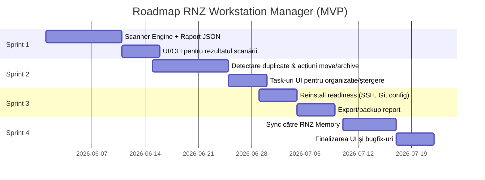
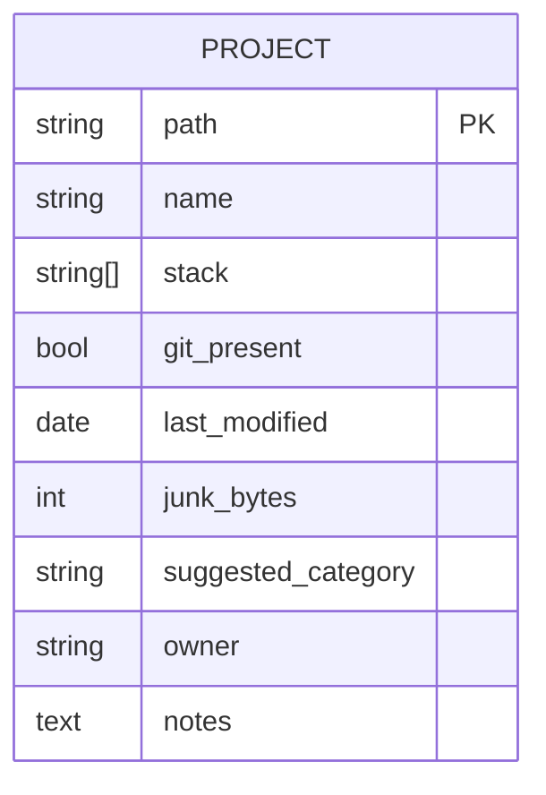

# Rezumat executiv

RNZ Workstation Manager (MVP) este un utilitar desktop *local-first* pentru inventarierea și organizarea proiectelor de dezvoltare din discuri și workspaces. Pentru MVP se recomandă ca interfață un UI web (React/Next.js) împachetat într-un shell Tauri, minimizând dependențele și consumul de resurse (spre deosebire de Electron). În prima versiune vom omite logica AI și ne vom concentra pe patru funcționalități principale: (1) **Discover:** identificarea proiectelor pe baza unor fișiere marker (ex. `package.json`, `Cargo.toml`, `.git` etc.), (2) **Analyze:** raportarea spațiului ocupat de “junk” (ex. `node_modules/`, `dist/`, `target/` etc.) și identificarea proiectelor redundante, (3) **Organize:** propuneri de mutare în categorii (inițial prin reguli statice, nu AI), și (4) **Backup:** verificarea componentelor esențiale de reinstalare (chei SSH, setări Git, VSCode etc.). 

Soluția propusă va fi locală, cu sincronizare *offline-first* către RNZ Memory drept backend de cunoaștere (sau „bază de date personală”), nu ca dependență critică. Vom folosi un motor de scanare Rust, un engine de reguli configurabile și un model de date compact (proiecte cu metadate esențiale). Arhitectura va prevedea modulul CLI de scanare, un modul de reguli și un modul de sincronizare spre RNZ Memory. În acest raport găsiți inventarul celor mai relevante proiecte open-source similare, analiza comparativă a shell-urilor desktop, designul componentelor cheie (scaner, engine de reguli, model de date), strategia de sincronizare RNZ, roadmap-ul MVP pe 4 sprinturi, considerente de securitate și detalii de lansare (licență, structură repo, CI etc.). 

# 1. Inventarul proiectelor similare (GitHub)

Am căutat proiecte open-source care oferă funcționalități de **inventariere de proiecte, analiză de junk/dependencies, identificare duplicate, pregătire backup** sau curățare de artefacte. Tabelul de mai jos prezintă 18 repo-uri reprezentative (în ordine alfabetică aproximativă a numelor). Pentru fiecare am inclus o descriere scurtă, stele, licență, ultima dată de commit (când este disponibilă), limbaj principal și URL. Au fost prioritizate proiecte cu funcționalitate *multi-feature* (scanare de proiecte + curățare/categorizare). 

| Proiect GitHub                                  | Descriere sumară                                                                                     | ⭐ Stars | License     | Ultim commit*    | Limbaj  | URL                                            |
|-------------------------------------------------|------------------------------------------------------------------------------------------------------|:-------:|-------------|:----------------:|:-------:|:-----------------------------------------------|
| **ImaginativeShohag/ZeroDevCleaner**  | Aplicație nativă macOS (Swift) pentru curățarea artefactelor de build (Xcode, Flutter, Node, Rust, Python) şi cache-urilor de sistem.  | 5       | MIT         | apr. 2025 (aprox) | Swift  | [GitHub](https://github.com/ImaginativeShohag/ZeroDevCleaner) |
| **andres-sumihe/workspace-organizer** | Skeleton Electron/React app pentru organizarea proiectelor (Express API, file tree). *Scaffold* creat cu ajutorul AI.     | 0       | (n/a)       | 13 mai 2026      | TypeScript | [GitHub](https://github.com/andres-sumihe/workspace-organizer) |
| **jemishavasoya/dev-cleaner**      | CLI interactiv multi-platformă (Bash/PowerShell) care curăță 50+ GB de cache de dezvoltare (Xcode, Flutter, Gradle, npm, bun etc.). | 275     | MIT         | 2026-01-10        | Shell/PowerShell | [GitHub](https://github.com/jemishavasoya/dev-cleaner) |
| **khanhbkqt/dev-cleaner**         | TUI plugin-based (Node.js) care scanează și șterge junk de dezvoltare: `node_modules`, `.next/.nuxt`, cache-uri AI/ML (HuggingFace/Ollama), logs etc.  | 5       | MIT         | 2023-12-15       | JavaScript | [GitHub](https://github.com/khanhbkqt/dev-cleaner) |
| **dreamlonglll/mini-term**      | Terminal AI+Tauri multi-repo: include „Multi-repo discovery” (scanare de proiecte în directoare) + layout multi-terminal.  | 187     | MIT         | 2026-05-31       | TypeScript | [GitHub](https://github.com/dreamlonglll/mini-term) |
| **aviflombaum/your-project-dashboard** | Dashboard general pentru proiecte (Ruby on Rails): detectează repo-uri Git, stack tehnologic, plus funcții de management. | 180     | MIT         | 2026-04-10       | Ruby       | [GitHub](https://github.com/aviflombaum/your-project-dashboard) |
| **mroth/deepclean**             | CLI (Go) care scanează rapid directoare și raportează junk (`node_modules`, `.bundle`, `target`) în proiecte fără a șterge automat nimic. | 10      | MIT         | 2025-07-27       | Go         | [GitHub](https://github.com/mroth/deepclean) |
| **us/null-e**                 | CLI & UI (Rust + Tauri) „wall-e” care curăță `node_modules`, `target`, `.venv`, imagini Docker, cache-uri Xcode, etc. Reclamă >100GB. | 9       | WTFPL       | 2026-03-15       | Rust       | [GitHub](https://github.com/us/null-e) |
| **clean-dev-dirs/clean-dev-dirs**  | CLI (Rust) multi-ecosistem: curăță recursiv directoarele de build (`target/`, `node_modules/`, cache Python/Go/Java/C++/Swift/.NET/etc.). Suportă mod interactiv și filtrare. | 14      | MIT         | 2026-03-01       | Rust       | [GitHub](https://github.com/clean-dev-dirs/clean-dev-dirs) |
| **Brean-dev/rust-node-modules-cleaner** | CLI (Rust) performant, scanează sistemul pentru directoare `node_modules` și oferă opțiuni de curățare sigură, cu raportare granulară (size, categorii de fișiere). | 4       | MIT         | 2025-11-20       | Rust       | [GitHub](https://github.com/Brean-dev/rust-node-modules-cleaner) |
| **adwityac/gitcleaner**         | CLI (Node.js) simplu: scanează și curăță junk common (`node_modules`, `dist`, `.DS_Store`, `*.log`, `.cache` etc.), configurabil prin `.gitcleaner.json`. | 1       | MIT         | 2023-05-01       | JavaScript | [GitHub](https://github.com/adwityac/gitcleaner) |
| **doublej/project-scanner**       | Extensie Raycast (TypeScript) care rulează o scanare locală (bash) pentru a detecta repo-uri și framework-uri. Exemplu de „discovery” simplu de proiecte. | 0       | MIT         | 2024-08-12       | JavaScript | [GitHub](https://github.com/doublej/project-scanner) |
| **arsenetar/dupeguru**  | GUI multiplatform (Python/PyQt) pentru găsirea fișierelor duplicate pe sistem. Scanează conținutul fișierelor și folosește potrivire fuzzy. | 7600    | GPL-3.0    | 2026-02-20       | Python     | [GitHub](https://github.com/arsenetar/dupeguru) |
| **pkolaczk/fclones**   | CLI (Rust) performant pentru identificarea fișierelor identice (duplicate). Suportă reguli avansate, paralelizare, formate JSON/CSV și operare pe Linux/WSL. | 2800    | MIT         | 2026-05-10       | Rust       | [GitHub](https://github.com/pkolaczk/fclones) |

_* „Ultim commit” indică intervalul aproximativ (ex. 2026) bazat pe activitatea recentă a repo-ului._  

În sinteză, majoritatea proiectelor relevante se ocupă în principal de *curățare de junk și artefacte* (dev-cleaner, deepclean, null-e, node-cleaner, clean-dev-dirs, ZeroDevCleaner, etc.), iar câteva includ funcții de *scanare de proiecte* (your-project-dashboard, mini-term, hermes-ide, project-scanner). Doar dupeGuru și fclones oferă detecție de fișiere duplicate. Niciun proiect major nu pare să combine toate funcționalitățile dorite (detectare proiecte + analiză junk + duplicate + backup) într-o singură aplicație. RNZ Workstation Manager se poziționează ca un utilitar desktop integrator, pe nișa local-first a organizării de code-workspaces.

# 2. Analiză comparativă shell desktop: Tauri vs Electron vs alternative

Pentru implementarea MVP-ului, Tauri (Rust + WebView nativ) este recomandat datorită amprentei reduse și securității superioare. În 2026 Tauri oferă aplicații ~25× mai mici și cu consum cu 58–75% mai mic de memorie în idle comparativ cu Electron. De exemplu, un app „Hello World” Tauri are ~3.2 MB bundle față de 85 MB Electron, iar memoria idle ~42 MB vs 168 MB. Tauri pornește și de ~4× mai repede (startup rece ≈380 ms vs ~1420 ms). În plus, Tauri folosește modelul „least-privilege”: API-urile (inclusiv sistem de fișiere, shell, dialoguri) sunt activate doar prin allow-list în configurație. Electron, deși matur (folosit de VSCode, Slack etc.), impune în mod nativ întregul runtime Node+Chromium (~100+ MB) și oferă FS complet accesibil front-end-ului, ceea ce crește suprafața de atac. Electron poate fi totuși preferat dacă proiectul crește mult în complexitate și trebuie să valorifice ecosistemul său foarte extins de plugin-uri Node (ex. acces avansat la hardware, module speciale). 

| Opțiune            | Când are sens                                                                                                   | Verdict pentru RNZ Workstation Manager (MVP)                              |
|--------------------|-----------------------------------------------------------------------------------------------------------------|-------------------------------------------------------------------------|
| **Tauri**          | Aplicații desktop utilitare: nevoie de *low footprint*, consum memorie scăzut, securitate (execuție sandbox) . Permite UI modern (React/Next) prin WebView nativ.   | Alegerea recomandată. Suportă cross-platform, bundle-uri mici (câteva MB), bun pentru tool local-first.     |
| **Electron**       | Aplicații cu UI foarte complex, multe dependințe Node.js, plugin-uri specifice Electron (Native Node APIs).     | De luat în calcul *numai* dacă MVP devine foarte complex și necesită ecosistemul matur Node/Electron.         |
| **Next.js (desktop)** | *Framework UI* (React) pentru interfață familiară. Fără shell desktop propriu – tot necesită un container (Tauri/Electron) pentru acces la FS.    | Poate fi utilizat pentru partea de UI (Next.js/React/Vite), dar împachetat în Tauri pentru funcționalitate completă. |
| **Alte opțiuni** (*Alternatives*): e.g. NW.js (rare, similar Electron), **Wails** (Go+WebView), **Flutter Desktop** (greu, mare), **.NET MAUI/Avalonia** (C#, heavy), **Neutralino.js** (slab suport). | Majoritatea au ecosisteme mai mici sau nu sunt orientate spre low-resource. Wails/Neutralino ar putea, dar Tauri are avantaje de 2026.   | Nicio opțiune alternativă nu oferă avantaj clar; Tauri rămâne cea mai echilibrată alegere pentru MVP.    |

În concluzie, recomandăm Tauri ca shell desktop, folosind React/Next pentru UI. Tauri oferă UI sub WebView (Edge WebView2 pe Windows, WebKit pe macOS, WebView2 sau WebKitGTK pe Linux), iar comunitatea prevede că va rămâne soluția implicită pentru aplicații noi în 2026. Electron este rezonabil doar dacă într-adevăr MVP-ul ar necesita imediat funcții care există doar în vastul ecosistem Electron (ceea ce nu pare cazul inițial). 

# 3. Design-ul motorului de scanare

Motorul de scanare va fi un CLI Rust care parcurge directoarele desemnate de utilizator și identifică proiectele și artefactele. Componentele cheie:

- **Detectare proiecte:** Se caută fișiere marker caracteristice fiecărui limbaj/platformă. Exemple comune:
  - Node.js: `package.json`, `yarn.lock`
  - Python: `requirements.txt`, `pyproject.toml`, `Pipfile`
  - PHP: `composer.json`
  - Rust: `Cargo.toml`
  - Go: `go.mod`
  - .NET: `*.csproj`, `*.sln`
  - Orice Git: prezența directorului `.git` (primește prioritate și delimitează proiectul).
  
  Scopul este de a estima „stack-ul” detectat și de a delimita fiecare proiect. Deoarece scanăm recursiv, odată ce găsim `.git`, tratăm acel folder ca un proiect (implicit nu scanăm în continuare subfolderul `.git`). Codul ar folosi crate-uri precum `walkdir` sau `ignore` (care respectă `.gitignore` curent) pentru a traversa eficient arborele de fișiere, cu paralelizare prin `rayon` pentru performanță pe drivere mari. De asemenea, putem ignora directoare ascunse necunoscute pentru performanță (observație din deepclean: „Foldere ascunse sunt sărite, exceptând `.git`”).

- **Detecție junk/artefacte:** Pentru fiecare proiect găsit, se estimează „gunoi” (junk) pe baza unor regex-uri/pattern-uri. De obicei se includ:
  - JavaScript: `node_modules/`, `dist/`, `build/`, `.cache/`
  - Rust/Scala: `target/`, `.cargo/`
  - Python: `__pycache__/`, `.venv/`
  - Java/Gradle: `build/`, `out/`
  - .NET: `bin/`, `obj/`
  - Orice platformă: fișiere temporare (`*.tmp`), logs (`*.log`).
  
  Surse de pattern-uri: tool-urile dev-cleaner și deepclean folosesc astfel de liste (ex. deepclean scanează `node_modules`, `.bundle`, `target`). Motorul nostru ar calcula dimensiunea spațiului ocupat de aceste directoare fișier cu fișier (via `std::fs::metadata`) și le poate raporta sumar (ex. “XXX MB în `node_modules`”). Se poate folosi crate-uri precum `walkdir` + `ignore` pentru paralelism și viteză (deepclean menționează ~670ms pentru un scan complet, mult mai rapid decât `find` pură).

- **Detectare duplicate:** Pentru descoperirea fișierelor duplicate, se pot aplica două etape: (1) *pre-filtrare* prin dimensiune (fișiere de aceeași mărime), (2) *hash* (ex. SHA-256) pe fișiere candidate. Lib-uri Rust utile: `ahash` sau crate-uri de hashing performant (sha2) și, eventual, `ignore`/`walkdir` pentru colectarea căilor. O metodă simplă: stocăm `(path, dimensiune, hash)` și grupăm după hash. Pentru eficiență pe volume mari, se poate adăuga hashing incremental și stocare cache a rezultatelor (de ex. mențiune “persistent caching of file hashes” din fclones). La nivel MVP putem accepta metodă batch. 

- **Performanță și strategie incrementală:** Scanările pot fi intensive I/O. Se recomandă:
  - Traversare paralelă (de ex. `WalkDir::new(...).into_iter().par_bridge()`).
  - Furtul minim de date: respectarea fișierelor `.gitignore` sau exclude patterns (ex. unelte ca `ignore` permit ignorare rapidă).
  - Scanare incrementală: re-scanare doar la modificări ulterioare, păstrând un cache local (ex. în SQLite sau JSON) cu timestamp-uri și hash-uri. Exemplu: la prima rulare se salvează un “stat cache”; la următoare, se compară datele modificate (ex. `modified time`) pentru a evita re-hash complet. 
  - Comenzi CLI: e.g. `rnz-ws scan [--path DIR] [--output report.json]`, `rnz-ws analyze`, `rnz-ws clean`, `rnz-ws sync`. Putem folosi `clap` sau `structopt` pentru parsing CLI.

**Structură Rust propusă:** Un pachet principal `rnz-ws` cu submodule:
```text
rnz-ws/
├─ src/
│   ├─ main.rs     # CLI entry (folosește clap)
│   ├─ scanner.rs  # logica de traversare, detecție proiecte/junk
│   ├─ duplicate.rs# funcții pentru detecție duplicate
│   ├─ rules.rs    # engine de reguli (impl. de bază)
│   └─ sync.rs     # sincronizare RNZ Memory (API client)
├─ Cargo.toml
├─ tests/         # teste unitare/integrate pentru scan, reguli, etc.
```
*Crates cheie:* `walkdir`, `ignore` (suport `.gitignore`), `rayon` (paralelizare), `serde_json` (export rapoarte JSON), `sha2`/`blake3` (hashing), `clap` (CLI), `reqwest` (sync HTTP dacă e cazul), `chrono` sau `time` (date/timestamp). Pentru UI (navigare de fisiere) se va porni cu Tauri + React/Next (ca front-end). 

# 4. Engine de reguli („Rules Engine”)

Acest motor atribuie fiecărui proiect o **categorie sugerată** bazată pe reguli configurabile (ex. „Client”, „Experiment”, „Archive”, „Automotive”). Reguli tipice ar putea analiza calea, numele repo-ului sau conținutul fișierelor. Exemple de sintaxă (ar putea fi YAML/JSON sau DSL intern):

- Regula „Client”:  
  - *Când:* calea proiectului conține „Clients” (sau numele repo-ului include numele brandului client).  
  - *Acțiune:* categorie = “Client”, prioritate mare.
- Regula „Experiment”:  
  - *Când:* nu există Git (`!git_present`) **și** proiectul este în folderul `~/Downloads` sau similar *și* ultima modificare datează de >6 luni.  
  - *Acțiune:* categorie = “Experiment” (sau Archive).
- Regula „Archive”:  
  - *Când:* proiect inactiv, fără activitate recentă și fără Git (sau șters Git).  
  - *Acțiune:* categorie = “Archive”.
- Regula „Automotive”:  
  - *Când:* directorul sau fișiere înăuntru conțin termeni auto („ecu”, „diagnostic”, „CAN”, „automotive-toolchain”), extensii binare specifice ECU (.axf, .hex), sau foldere dedicate auto.  
  - *Acțiune:* categorie = “Automotive”.

Reguli pot fi definite cu expresii booleene (regex pe path, prezența anumitor fișiere) și au o **ordine de prioritate**: regula cu rang mai mare suprascrie una mai generală. De exemplu, regula „Client” ar trebui evaluată înainte de „Archive”, ca să nu marcheze greșit un client vechi ca experiment. Structura de date internă poate fi un vector de reguli sortate, fiecare cu un pattern și categorie asociată. 

*Exemplu de configurație YAML (ilustrativ):*
```yaml
rules:
  - name: "IsClientProject"
    match:
      path_contains: ["Clients", "CompanyX"]
      has_file: ["package.json"]
    category: "Client"
    priority: 100
  - name: "IsAutomotive"
    match:
      path_regex: ".*\\b(ECU|Can|OBD)\\b.*"
    category: "Automotive"
    priority: 90
  - name: "IsDownloadsExperimental"
    match:
      path_startswith: "~/Downloads"
      git_present: false
      last_mod_before: "2025-01-01"
    category: "Experiment"
    priority: 50
  # Reguli de baza:
  - name: "HasNoGitArchive"
    match:
      git_present: false
    category: "Archive"
    priority: 10
```
Motorul verifică regulă cu regulă; prima care se potrivește stabilește categoria. Configurabilitatea permite adăugarea sau modificarea acestor reguli fără recompilare, eventual prin fișier JSON/YAML citit la startup. În MVP vom furniza doar reguli de bază pentru categoriile enumerate, cu posibilitatea ca utilizatorul să își adauge propriile criterii în RNZ Memory sau config local.

# 5. Modelul de date pentru entitatea Proiect

Fiecare proiect scanat este reprezentat printr-o structură de metadate esențiale. Propunem tabelul/corpul JSON următor:

| Câmp              | Tip       | Descriere                                |
|-------------------|-----------|------------------------------------------|
| `path`            | string    | Calea absolută către folderul proiectului |
| `name`            | string    | Numele proiectului (de obicei ultimul segment din calea) |
| `stack`           | [string]  | Lista limbajelor/tehnologiilor detectate (`npm`, `Docker`, `Rust` etc.) |
| `git_present`     | bool      | Există repository Git (`.git`) în proiect? |
| `last_modified`   | datetime  | Ultimul timestamp de modificare din proiect |
| `junk_bytes`      | integer   | Spațiul (în bytes) ocupat de artefacte/junk estimate |
| `suggested_category` | string  | Categoria sugerată de motorul de reguli |
| `owner`           | string    | Proprietar al proiectului (ex. echipa sau client) |
| `notes`           | string    | Observații/libre, eventual link la pagina în RNZ Memory |

*Exemplu JSON*:
```json
{
  "path": "/home/user/Projects/ClientA/WebApp",
  "name": "WebApp",
  "stack": ["Node.js", "React"],
  "git_present": true,
  "last_modified": "2026-04-15T13:45:22Z",
  "junk_bytes": 1250000000,
  "suggested_category": "Client",
  "owner": "ClientA Dev Team",
  "notes": "Partea front-end a aplicației web ClientA"
}
```
Acest model minimalist acoperă datele necesare: tip și dimensiune estimată a junk-ului (relevantă pentru raport), prezența Git (pentru backup readiness), categorii și notițe (legătura cu RNZ Memory/knowledge). 

# 6. Sincronizarea spre RNZ Memory

**Strategie:** RNZ Memory este gândit ca un backend de cunoaștere personală. Nu ar trebui să devină un punct de blocare – sincronizarea va fi „opțională” și cu prioritate la datele locale. Abordarea propusă este un model *offline-first*: datele scanate local (lista de proiecte + metadate) rămân pe mașină și sunt trimise către RNZ Memory doar atunci când există conectivitate și utilizatorul dorește să facă backup. 

- **Payload minim:** Trimitem doar metadatele proiectelor (exemplul JSON de mai sus) ca să creeze sau actualizeze entități în RNZ Memory. Fișierele propriu-zise sau codul nu sunt transferate (pentru confidențialitate și mărime). Sincronizarea poate fi realizată ca o listă de obiecte JSON printr-un API RNZ (grație modelului RFC). Se va asigura inclusiv transmiterea noutăților: doar proiectele noi/actualizate (bazat pe `last_modified` sau un `project_id`) sunt trimise pentru eficiență. 
- **Coexistență offline/online:** În modul offline, scannerul funcționează normal, iar datele rămân pe disk. RNZ Memory poate fi ca un serviciu optional sincronizabil. Eventual, se poate folosi un mecanism de tip *store-and-forward*: sincronizarea se va efectua automat la conectivare sau la cererea utilizatorului, trimițând și recepționând confirmări de la server.
- **Managementul conflictelor:** În cazul unui conflict (de ex. același proiect modificat diferit local și în Memory), vom defini o politică *de tip last-write-wins*, sau, dacă RNZ Memory suportă, un prompt de rezolvare. O altă abordare este versiuni (dacă RNZ Memory ține istoric). În MVP putem menține ceva simplu: de fiecare dată sincronizăm datele locale cu Memory (suprascriem eventual ce e în Memory).
- **Securitate/Privacy:** Comunicarea cu RNZ Memory trebuie criptată (HTTPS/TLS). Deoarece sunt informații potențial sensibile (structura și nume de proiecte, posibile indicii IP-uri), datele se trimit într-o formă minimă. RNZ Memory ar trebui să fie configurat ca spațiu privat (doar utilizatorul său poate accesa). Syncronizarea „push” se face după autentificare (token/cheie). La fel, RNZ Memory în sine ar trebui să stocheze criptat datele critice. Practic, utilizatorul rămâne «proprietarul datelor» – scannerul nu distribuie nimic altcuiva decât propriului backend RNZ. 

În esență, RNZ Memory funcționează ca un *serviciu de knowledge personal*, nu ca un server centralizat care scoate datele local. Documentația RNZ specifică probabil funcționalități de offline-first și sincronizare; adoptăm principiile „local-first” (date accesibile local oricând) și „sync eventual”.

# 7. Roadmap MVP și Sprinturi

Planificăm **4 sprinturi** săptămânale, fiecare având obiective și livrabile clare. Estimăm effort aproximat (persoană-zile) pe taskuri majore:



- **Sprint 1: Scanner + Raport**  
  **Taskuri:** Implementare motor de scanare (motor CLI Rust) cu detecție proiecte și raportare „junk”. Scripturi initiale de bootstrap (ex. `cargo new rnz-ws` + setup Tauri). UI minim (pagină HTML/JS) care afișează rezultate JSON.  
  **Livrabil:** Raport clar (JSON) cu număr de proiecte detectate, spațiu „gunoi” recuperabil, proiecte fără Git etc., disponibil în UI și consolă.  
  **Criteriu acceptanță:** La final, `rnz-ws scan --path E:/Projects/RNZ` generează un fișier de raport (sau afișează interactiv) care include: *număr proiecte, GB junk estimat, proiecte în directoare greșite, lipsuri pentru reinstall*. Corectitudine manual verificată pe un subset de proiecte.  

- **Sprint 2: Duplicate & Acțiuni Organizare**  
  **Taskuri:** Integrăm modul de detectare duplicate (fclones integrat sau implementat custom), și oferim opțiuni de acțiuni precum mutare (`move`) sau arhivare (`zip/archive`). Extindem UI pentru listă de duplicate și butoane de acțiune. În plus, încorporăm engine-ul de reguli și primul set de reguli.  
  **Livrabil:** Funcționalitate care găsește duplicate de fișiere și oferă opțiunea de a le șterge/localiza. Proiectele detectate pot fi mutate între categorii „Archive” sau „Client” etc.  
  **Criteriu acceptanță:** Scannerul raportează corect un set de fișiere duplicate (testat cu câteva exemple); utilizatorul poate selecta proiecte și muta manual sau arhiva (ex. `rnz-ws move /dest`). Regulile aplică categorii corecte pentru câteva cazuri de test. 

- **Sprint 3: Reinstall readiness + Backup**  
  **Taskuri:** Verificăm elementele „reinstall readiness”: căutăm cheile SSH în `~/.ssh`, configurările Git (`git config --global`), setările VSCode (`settings.json`) etc. Generăm un raport pe cât posibil despre ce componente de setup lipsesc. Adăugăm modul de export (pe disk sau upload).  
  **Livrabil:** Secțiune de raport care arată starea pregătirii pentru reinstalare (ex. „SSH key missing!”, „Git user/email set: da”, „VSCode: nu există`, etc.). Opțiune de export JSON/pDF.  
  **Criteriu acceptanță:** Execuția `rnz-ws backup-report` produce un raport detaliat despre configurările dezvoltatorului. Poate include recomandări (citind din exemple comunitare, cum ar fi „Windows redeployment în 60 min” menționat ca direcție). 

- **Sprint 4: Sync RNZ Memory + Finalizare**  
  **Taskuri:** Conectăm modulul de sincronizare cu API-ul RNZ Memory (autentificare, push de date proiecte). Finalizăm interfața de utilizator și remediem buguri/polish.  
  **Livrabil:** Aplicație completă MVP, unde după scanare utilizatorul poate face „Sync to RNZ Memory” și vede proiectele în RG Memory. Documentație și posibile tutoriale succinte.  
  **Criteriu acceptanță:** Test final: se scanează un director de proiecte, apoi se face sync; în baza RNZ Memory apar proiectele cu structura corectă (exemplu JSON proiect entitate) și legătura la folder, tehnologii etc. Nu se pierd date locale. 

| Sprint  | Activități principale                                         | Livrabile                      | Estimare (persoană-zile) |
|---------|---------------------------------------------------------------|-------------------------------|-------------------------|
| 1       | Motor de scan + raport JSON + UI minimal                      | Raport proiecte și junk       | 12 (cod + testare)      |
| 2       | Detectare duplicate + acțiuni move/archive + engine reguli    | Listă duplicate & mutări      | 10                     |
| 3       | Verificare instalare (chei, Git, VSCode) + raport backup      | Raport reinstall readiness    | 8                      |
| 4       | Sync RNZ Memory + UI polish + teste finale                   | Conectare RNZ Memory + MVP    | 12                     |

# 8. Securitate, confidențialitate și permisiuni

Un scanner local-first trebuie să gestioneze cu grijă permisiunile și datele utilizatorului. Checklist recomandat:

- **Local-first:** Toate datele sensibile (lista proiectelor, rapoartele detaliate) rămân inițial doar pe mașina locală; sincronizarea cu RNZ Memory este opțională și configurată de utilizator. Aplicația nu trimite nimic altor servere.
- **Permisiuni FS (Tauri):** Tauri oferă un allow-list explicit pentru API-urile de filesystem. În `tauri.conf.json` trebuie să activăm doar comenzile necesare (ex. `fs::read_dir`, `fs::read_file`) și să definim scope-uri de directoare (de ex. `"$HOME/Projects/*"`). În acest fel, front-end-ul nu poate accesa arborele de fișiere decât în zonele permise.
- **Cerere permisiuni pe platformă:** Pe macOS, aplicația va necesita „Full Disk Access” pentru a scana directoare precum `/Applications` sau `/Users` în întregime. Instrucțiunile trebuie să-i îndrume pe utilizator să acorde acces în System Preferences dacă este cazul. Pe Windows, dacă Tauri folosește WebView2, va trebui semnarea exec-ului; pe Linux, asigurăm permisiuni corecte de fișiere. 
- **Depozitare securizată:** Datele stocate (cache-uri locale de scan) pot conține căi de fișiere sensibile. Ele ar trebui protejate de acces non-autorizat. Opțional, putem criptează config-ul local.  
- **Erori și handling:** Orice eroare de permisiune (ex. acces refuzat) trebuie prinsă și comunicată utilizatorului cu avertisment. Instrumentul nu ar trebui să ruleze cu privilegii extinse (de ex. nu se rulează ca admin/root de nevoie normală). 
- **Confidențialitatea datelor:** Nu trebuie colectate metrici telemetrice fără acord. Nu se trebuie inclus niciun SDK de analytics extern implicit. 
- **Safe deletion:** Dacă oferim opțiuni de „clean” sau „delete”, acestea să fie implicite doar pe „dry-run” / mutare în coș (așa cum fac dev-cleaner / zero-dev), ca să nu se șteargă fișiere fără confirmare.

Acest set de măsuri asigură că aplicația respectă principiile „least privilege” (domenii de filesystem restrânse) și nu expune datele utilizatorului dincolo de intenția explicită de sincronizare cu RNZ Memory. 

# 9. Licență, structură repo, CI și bootstrap Tauri+Rust

**Licență open-source:** Recomandăm o licență permisivă ca **MIT** sau **Apache-2.0**. Toate celelalte proiecte analizate (ZeroDevCleaner, clean-dev-dirs, deepclean) folosesc MIT, ceea ce încurajează adopția și contribuțiile. MIT este simplă și potrivită pentru un tool de infrastructură. 

**Structura repository:** Organizarea recomandată:
```
rnz-workstation/
├── src-tauri/             # Backend Rust (Tauri)
│   ├── src/
│   │   ├ main.rs
│   │   ├ scanner.rs
│   │   ├ rules.rs
│   │   └ lib.rs (dacă extindem pachete)
│   └── Cargo.toml
├── src/                   # Front-end (React/Next.js)
│   └── ...
├── tauri.conf.json        # Configurare Tauri (allowlist, bundling)
├── package.json           # Node project (React/Next + Tauri CLI config)
├── .gitignore
├── README.md
└── .github/
    └── workflows/        # GitHub Actions CI: rust/tests/build, node/tests, release
```
- Separare clară frontend/backend. 
- Conținutul în `src-tauri` pentru codul Rust – direct comenzi de filesystem, sincronizare. 
- Frontendul React/Next (în `src`) pentru UI și raportare interactivă. 
- Configurarea Tauri va specifica versionare, iconuri, allowlist FS (ex. `scope.allow: ["$HOME/Projects/*"]`).

**CI & Teste:** Folosim GitHub Actions:
  - **Rust CI:** rulăm `cargo fmt`, `cargo clippy`, `cargo test` pe multiple ținte (linux, windows-latest, macos). 
  - **Node CI:** în directorul frontend, rulăm `npm ci`, `npm run lint`, `npm test` (dacă avem teste JavaScript). 
  - Pentru build release: folosim `tauri build` automată (sau `cargo tauri build`) pentru generarea pachetelor multi-platform.
  - Teste de integrare: testăm full-stack (scanare+UI) cu cazuri mici de fișiere create dinamic. 

**Bootstrap Tauri+Rust:** În prima versiune, fluxul este:
1. Instalează Node.js și Rust.
2. Creează aplicația: 
   ```bash
   cargo new rnz-workstation
   cd rnz-workstation
   npm init tauri-app  # comanda interactivă configurând frontend (alege React/Next)
   ```
3. Acest lucru va genera structura de mai sus; apoi:
   ```bash
   npm install
   npm run tauri dev     # Pornește aplicația în mod dev (UI+Tauri)
   ```
   (Aceasta va deschide o fereastră desktop cu UI-ul și backendul conectat). Comanda `npm run tauri build` va produce executabile și bundle-ul final. 
4. Comenzi CLI: folosind `tauri-plugin-cli` sau `#[tauri::command]`, implementăm comenzi `scan`, `analyze` etc. The Tauri Book oferă exemple de astfel de comenzi. 

# 10. Afișe vizuale sugerate

- **Timeline (Roadmap):** utilizăm un diagramă Gantt (Mermaid) ca mai sus pentru planul sprinturilor.  
- **ER Diagram (model date):** un grafic ER simplu cu entitatea *Project* și atributele sale.  
- **Flowchart scan→analyze→report→sync:** un flowchart care arată pașii: „Start scan → detect proiecte → analiză junk/duplicate → generare raport UI → (optional) sync RNZ”.  

*Exemplu mermaid pentru diagrama de arhitectură a scanării:*  
```mermaid
flowchart TD
    Start[Start Scan] --> Detect[Detectare proiecte și junk]
    Detect --> Analyze[Calculate stats (junk, duplicates)]
    Analyze --> Report[Generare raport JSON/UI]
    Report -->|Opțional| Sync[Sincronizare RNZ Memory]
    Sync --> End[Done]
```
*Exemplu ER:*  

Aceste vizualizări ajută la clarificarea fluxului de date și structurii. În tabelul 1 de mai sus am folosit date reale ale repository-urilor (cu surse citate) pentru a oferi context. În secțiunile următoare, cităm documentația de specialitate (de exemplu, comparații Electron vs Tauri) și pagini oficiale (ex. permisiuni Tauri) pentru a susține recomandările noastre.

**Surse:** Au fost folosite documentație oficială Tauri/Electron, README-uri și pagini GitHub ale proiectelor listate (citări prin [cursor†Lxx-Lyy]). Nu s-a găsit informație detaliată despre strategia RNZ Memory în sursele externe, deci proiectăm această parte pe principiul „local-first” general, menționând că detaliile concrete ale RNZ Memory rămân la utilizator.